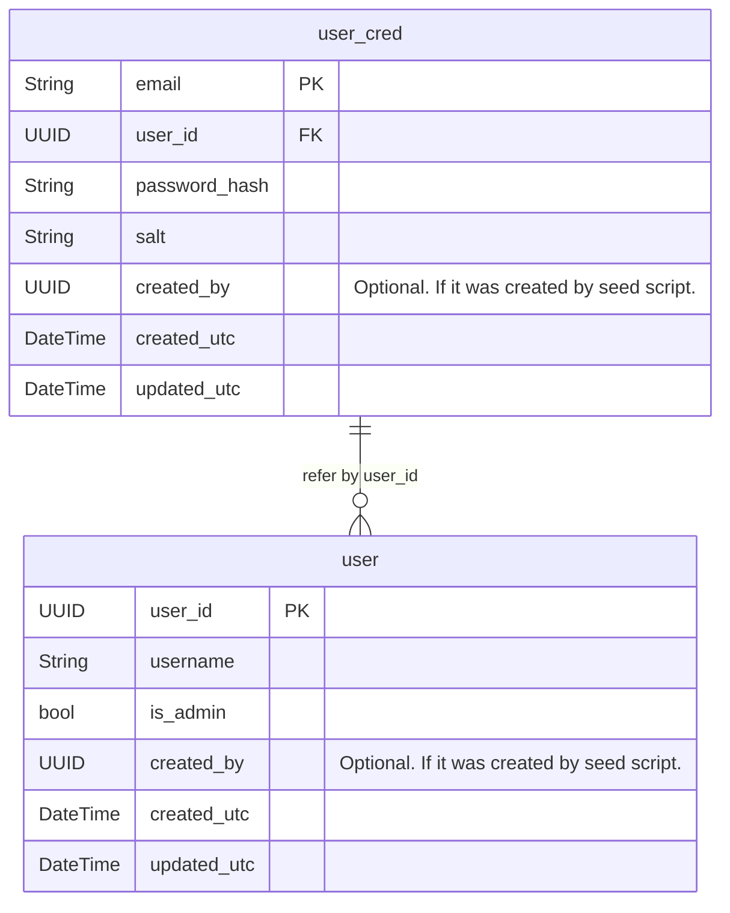

```mermaid
erDiagram
    user {
        UUID user_id PK
        String username
        bool is_admin
        UUID created_by "Optional. If it was created by seed script."
        DateTime created_utc
        DateTime updated_utc
    } 
    user_cred {
        String email PK
        UUID user_id FK
        String password_hash
        String salt
        UUID created_by "Optional. If it was created by seed script."
        DateTime created_utc
        DateTime updated_utc
    }
    user_cred ||--o{ user: "refer by user_id"
```

